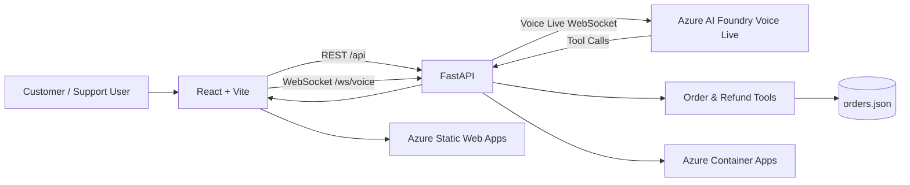

# Maya AI Voice Customer Support Agent

**Working prototype / proof of concept**

Maya is an AI-powered voice customer support agent for an online electronics store. It combines a React/Vite frontend, FastAPI backend, Azure AI Foundry Voice Live, REST APIs, and WebSockets to automate common order and refund support workflows.

**Team:** Pranjal · Damanjeet Singh · Kritindeep · Sania Sodhi

## ✨ Features

* 🔎 Order lookup and delivery information
* 💳 Refund requests with duplicate protection
* 📅 Working-day refund tracking
* ⚠️ Automatic overdue refund detection
* 🎫 Complaint ticket creation
* 🎙️ Real-time browser voice support
* 👨‍💼 Human escalation
* 📊 Support dashboard
* ❤️ Backend health monitoring

## 🏗️ Architecture



### Core Responsibilities

* **Frontend:** Dashboard, order/refund UI, microphone capture, transcripts and audio playback.
* **FastAPI:** REST APIs, WebSocket bridge, validation and business logic.
* **Azure Voice Live:** Real-time speech interaction, transcription, response generation and tool calling.
* **Backend Tools:** Controlled order, refund, tracking and escalation operations.
* **Data Store:** Prototype data stored in `data/orders.json`.

## 🤖 AI Capabilities

* Generative AI
* Prompt engineering
* Conversational AI
* Function/tool calling
* Grounding with application data
* Real-time voice interaction
* Speech processing
* REST API integration
* Azure cloud deployment
* Responsible-AI safeguards

**Not currently implemented:** RAG/vector search and formal AI evaluation.

## 🛠️ Tech Stack

| Technology                  | Purpose            |
| --------------------------- | ------------------ |
| Python 3.11+                | Backend            |
| FastAPI + Uvicorn           | REST/WebSocket API |
| React + Vite                | Frontend           |
| Azure AI Foundry Voice Live | Voice AI           |
| aiohttp                     | WebSocket client   |
| JSON                        | Prototype storage  |
| Docker                      | Containerization   |
| Azure Container Apps        | Backend hosting    |
| Azure Static Web Apps       | Frontend hosting   |
| Azure Container Registry    | Image registry     |
| Python unittest             | Testing            |
| Oxlint                      | Frontend linting   |

## 📁 Project Structure

```text
.
├── server.py
├── order_store.py
├── data/orders.json
├── support_agent.py
├── requirements.txt
├── requirements-local.txt
├── Dockerfile
├── .env.example
├── tests/
│   ├── test_dashboard_summary.py
│   └── test_refund_tracking.py
└── frontend/
    ├── src/
    │   ├── App.jsx
    │   ├── config.js
    │   ├── hooks/useVoice.js
    │   ├── components/
    │   └── pages/
    ├── public/pcm-processor.js
    ├── package.json
    └── vite.config.js
```

## 🚀 Setup

### Prerequisites

* Python 3.11+
* Node.js + npm
* Azure AI Foundry Voice Live resource
* Browser with microphone support
* Docker Desktop *(optional)*

### Backend

```powershell
python -m venv .venv
.\.venv\Scripts\Activate.ps1
pip install -r requirements.txt
Copy-Item .env.example .env
```

Add Azure configuration to `.env`:

```powershell
uvicorn server:app --reload --host 127.0.0.1 --port 8000
```

### Frontend

```powershell
cd frontend
npm install
npm run dev
```

Frontend: `http://localhost:5173`

## 🧪 Testing

```powershell
python -m unittest discover -s tests -v
npm run lint
npm run build
```

Verified during development:

* Backend tests: **5 passed**
* Frontend lint: **passed**
* Production build: **passed**
* Docker build: **passed**
* Local dashboard and order/refund workflows: **validated**
* Backend health endpoint: **validated**
* End-to-end Azure Voice WebSocket: **requires manual confirmation**

## 🔐 Security

* Azure credentials remain backend-only.
* `.env` is excluded from Git.
* `VITE_*` variables must contain public URLs only.
* Use HTTPS/WSS in deployed environments.
* Never commit API keys, tokens or passwords.

## ⚠️ Limitations

This is a **prototype, not a production support platform**.

* `orders.json` is not suitable for durable multi-instance storage.
* Authentication and authorization are not implemented.
* Refund fulfillment is simulated.
* Demo data is small and static.
* Formal AI quality/safety evaluation is not implemented.
* Voice functionality depends on Azure Voice Live, credentials, browser permissions and network connectivity.

## 🔮 Future Scope

* Replace JSON with Azure Cosmos DB, Table Storage or SQL
* Add authentication and role-based authorization
* Integrate real payment/refund processing
* Add human-agent handoff
* Add multilingual voice and text
* Add monitoring, logging and tracing
* Add automated AI evaluation
* Add customer history and case management
* Add audit logs and rate limiting
* Add CI/CD quality gates

## 🎬 Demo Flow

1. Show the support dashboard.
2. Search order `A1001`.
3. Demonstrate refund tracking and duplicate protection.
4. Start voice support and ask about an order/refund.
5. Show the backend tool call.
6. Explain the React → FastAPI → Azure Voice Live architecture.
7. Show test/build results.
8. Discuss limitations and future scope.


