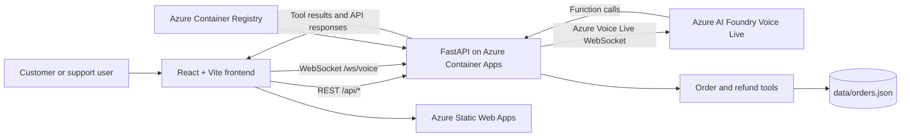

# Maya AI Voice Customer Support Agent

**Status:** Working prototype / proof of concept

Maya is an AI-powered customer support agent for an online electronics store. It combines a React and Vite frontend, a FastAPI backend, Azure AI Foundry Voice Live, REST APIs, and browser WebSocket communication to support order lookup, refund requests, refund tracking, complaint tickets, and human escalation.

**Team members:** Not specified in the repository.

## 1. Problem Statement

Customers frequently need answers to repetitive operational questions:

- Where is my order?
- What did I purchase and when will it arrive?
- Has my refund been requested?
- When should the refund reach my bank account?
- What happens if the refund is late?
- Can I request human assistance?

Manual support workflows require an agent to identify the customer order, inspect its status, calculate refund timelines, and create follow-up records. This can increase response time and create inconsistent answers for common requests.

Maya addresses this use case for customers and support staff at an online electronics store. The prototype provides a dashboard for support operations and a voice interface for customers who prefer spoken interaction. The system is limited to the workflows implemented by the backend tools and does not claim to replace human support for every issue.

## 2. Solution Overview

The user can interact with Maya through the React dashboard or browser microphone. The frontend provides pages for overview metrics, order lookup, refund requests, voice assistance, conversation history, escalation, and settings.

The AI component is Azure Voice Live. It receives the conversation through a server-side FastAPI WebSocket bridge and can request structured backend tools. The backend performs the actual order lookup, refund mutation, refund-date calculation, overdue detection, complaint creation, and escalation response. Tool results are returned to the model so spoken responses can be based on application data.

This distinction is important:

- **AI responsibilities:** understand spoken requests, maintain the conversation, decide when a tool is needed, and produce a concise spoken response.
- **Backend responsibilities:** validate and execute business operations, read and persist order data, calculate dates, generate complaint metadata, and expose APIs.

## 3. Key Features

| Feature | Description | Evidence | Interaction type |
| --- | --- | --- | --- |
| Order lookup | Returns item, order status, carrier, delivery estimate, total, refund, and complaint fields. | `server.py:look_up_order`, `GET /api/orders/{order_id}` | Text and voice |
| Refund request | Creates a refund ticket, stores the reason and amount, and rejects duplicate requests. | `server.py:start_refund`, `POST /api/refund` | Text and voice |
| Working-day refund tracking | Calculates seven working days after the issue date, excluding weekends. The issue date is day zero. | `order_store.py:calculate_expected_refund_date` | Backend |
| Overdue detection | Marks active refunds overdue after their expected date. Completed refunds are excluded. | `order_store.py:is_refund_overdue`, `_ensure_refund_tracking` | Backend |
| Complaint tickets | Creates one complaint for an overdue refund and reuses the existing ticket. | `order_store.py:_ensure_refund_tracking` | Backend and dashboard |
| Dashboard summary | Shows order totals, refund counts, amounts, recent refunds, and complaints. | `GET /api/dashboard/summary`, `Overview.jsx` | Text/dashboard |
| Refund listing | Lists refund tickets, dates, status, remaining working days, and complaint status. | `GET /api/refunds`, `RefundRequest.jsx` | Text/dashboard |
| Voice support | Streams browser PCM16 audio to Azure Voice Live and plays streamed assistant audio. | `useVoice.js`, `server.py:/ws/voice` | Voice |
| Human escalation | Creates a queued escalation response with a ticket and estimated wait. | `POST /api/escalate`, `escalate_to_human` | Text and voice |
| Health monitoring | Returns a simple health response for local and container checks. | `GET /health` | Backend |

## 4. Solution Architecture and Data Flow



### Component responsibilities

- **React/Vite frontend:** renders the support interface, sends REST requests, captures microphone audio, maintains transcript state, and plays assistant audio.
- **Azure Static Web Apps:** hosts the built frontend files from `frontend/dist`.
- **FastAPI backend:** exposes REST routes, owns Azure credentials, validates requests, manages order/refund business logic, and proxies the browser voice session.
- **Azure Container Apps:** hosts the containerized FastAPI service with port 8000 and WebSocket ingress.
- **Azure Voice Live:** performs real-time conversational AI, transcription, speech activity handling, streamed response generation, and tool-call requests.
- **Backend tools:** provide controlled operations for order lookup, refund creation, refund timeline lookup, and escalation.
- **JSON data store:** stores prototype order, refund, and complaint state in `data/orders.json`.
- **Azure Container Registry:** stores the backend container image used for Container Apps deployment.

### REST flow

1. A frontend page calls an `/api/...` endpoint.
2. FastAPI validates the request and invokes the relevant business function.
3. `order_store.py` reads or atomically updates `data/orders.json`.
4. FastAPI returns structured JSON to the frontend.
5. The dashboard refresh event reloads the summary after successful refund activity.

### Voice flow

1. The browser opens `/ws/voice` and requests microphone permission.
2. `pcm-processor.js` converts microphone input to mono PCM16 at 24 kHz.
3. React sends Base64 audio chunks to FastAPI.
4. FastAPI forwards browser events to Azure Voice Live.
5. Azure uses server-side voice activity detection and may request a backend function.
6. FastAPI executes the function and sends the JSON result back to Azure.
7. Azure response audio and transcript events are forwarded to React.

## 5. AI-103 Concepts Applied

| AI-103 concept | How it is applied | Evidence in this project | Status |
| --- | --- | --- | --- |
| Generative AI | Azure Voice Live generates conversational responses from the user turn and tool results. | `server.py:TOOLS_SCHEMA`, `_build_session_config`, `INSTRUCTIONS` | Implemented |
| Prompt engineering | System instructions define Maya's role, concise phone responses, order-ID confirmation, factual responses, and escalation behavior. | `server.py:INSTRUCTIONS`, `support_agent.py:INSTRUCTIONS` | Implemented |
| Conversational AI | The agent maintains a turn-based voice interaction with greeting, speech detection, transcript events, interruptions, and spoken responses. | `frontend/src/hooks/useVoice.js`, `VoiceAssistant.jsx` | Implemented |
| Tool/function calling | The model can request structured functions rather than directly mutating application data. | `TOOLS_SCHEMA`, `AVAILABLE_FUNCTIONS`, `_execute_tool` | Implemented |
| Grounding with application data | Order and refund answers are obtained from the backend store and returned as tool output. | `look_up_order`, `get_refund_timeline`, `order_store.py` | Implemented |
| API integration | The React application uses FastAPI REST routes for order, refund, dashboard, health, and escalation workflows. | `server.py`, frontend page components | Implemented |
| Real-time AI interaction | Browser WebSocket audio is bridged to Azure Voice Live, with streamed audio and transcript events. | `server.py:voice_proxy`, `useVoice.js` | Implemented |
| Speech processing | Browser audio is converted to PCM16 mono at 24 kHz and Azure transcription is enabled. | `frontend/public/pcm-processor.js`, Voice Live session configuration | Implemented |
| Cloud deployment | The backend is containerized for Azure Container Apps and the frontend is built for Azure Static Web Apps. | `Dockerfile`, Vite build, Azure deployment configuration outside source | Implemented prototype deployment |
| Secret management | Azure credentials are read by the backend from environment variables or deployment secret references; they are not placed in frontend code. | `server.py`, `.env.example`, `.gitignore` | Implemented basic safeguard |
| Responsible AI controls | The prompt instructs the model not to guess facts, while backend validation and human escalation cover unsupported or sensitive cases. | `INSTRUCTIONS`, Pydantic request models, escalation route | Partial |
| Retrieval-augmented generation | No vector database, Azure AI Search, embedding pipeline, or document retrieval layer is present. | Repository inspection | Future scope |
| Formal model evaluation | No automated quality, safety, bias, or groundedness evaluation pipeline is present. | Repository inspection | Future scope |

## 6. Technology Stack

| Technology | Purpose | Where it is used |
| --- | --- | --- |
| Python 3.11+ | Backend language | `server.py`, `order_store.py`, `support_agent.py` |
| FastAPI | REST and WebSocket application framework | `server.py` |
| Uvicorn | ASGI server | Local startup and `Dockerfile` |
| Pydantic | Request validation | `server.py` |
| React | Frontend UI | `frontend/src` |
| Vite | Frontend development server and production bundler | `frontend/package.json`, `vite.config.js` |
| JavaScript | Frontend application and audio logic | `frontend/src`, `frontend/public` |
| Azure AI Foundry Voice Live | Real-time voice AI, transcription, streamed responses, and tool calling | `server.py`, `support_agent.py` |
| aiohttp | Backend WebSocket client to Azure Voice Live | `server.py` |
| PyAudio | Local microphone/speaker client only | `support_agent.py`, `requirements-local.txt` |
| JSON file storage | Prototype order, refund, and complaint persistence | `data/orders.json`, `order_store.py` |
| Docker | Backend packaging and local container testing | `Dockerfile`, `.dockerignore` |
| Azure Container Registry | Container image registry | Deployment target for the backend image |
| Azure Container Apps | Backend hosting with HTTP and WebSocket ingress | Deployed backend |
| Azure Static Web Apps | Frontend hosting | Deployed frontend |
| Python `unittest` | Backend tests | `tests/` |
| Oxlint | Frontend linting | `frontend/package.json` |

## 7. Azure Services and Deployment

### Azure AI Foundry Voice Live

Provides the real-time conversational voice capability. The backend connects server-side using environment-configured credentials. The browser never receives the Azure API key.

### Azure Container Registry

Stores the Docker image used by the FastAPI backend deployment. The project Dockerfile installs `requirements.txt` only and excludes the standalone PyAudio client.

### Azure Container Apps

Hosts the FastAPI backend on port 8000. It provides external HTTP ingress and WebSocket support for `/ws/voice`. The deployed backend is:

```text
https://maya-support-backend.thankfulsea-70177418.centralindia.azurecontainerapps.io
```

### Azure Static Web Apps

Hosts the Vite production output from `frontend/dist`. The current frontend hostname is:

```text
https://agreeable-pond-0b33d0800.2.azurestaticapps.net
```

The backend CORS configuration includes the local development origin and the deployed Static Web Apps origin.

### Deployment caution

This is a working prototype, not a production-ready support platform. The JSON store is not a durable shared database for multiple replicas, and authentication, authorization, monitoring, and formal AI evaluation require further work.

## 8. Project Structure

```text
.
├── server.py                 # FastAPI REST API and Azure Voice Live proxy
├── order_store.py            # Order, refund, working-day, and complaint logic
├── data/
│   └── orders.json           # Prototype order and refund records
├── support_agent.py          # Standalone local PyAudio voice client
├── requirements.txt          # Backend/cloud dependencies
├── requirements-local.txt    # Backend dependencies plus local PyAudio
├── Dockerfile                # FastAPI container image
├── .dockerignore             # Container build exclusions
├── .env.example              # Backend environment template
├── tests/
│   ├── test_dashboard_summary.py
│   └── test_refund_tracking.py
└── frontend/
    ├── package.json          # Vite scripts and JavaScript dependencies
    ├── vite.config.js        # Vite build and development proxy
    ├── .env.example          # Public frontend URL overrides
    ├── src/
    │   ├── App.jsx
    │   ├── config.js         # REST and WebSocket base URL logic
    │   ├── hooks/useVoice.js # Browser voice WebSocket and audio flow
    │   ├── components/       # Shared UI components
    │   └── pages/            # Dashboard and support workflows
    └── public/
        └── pcm-processor.js  # AudioWorklet processor
```

Generated or local-only directories such as `.venv`, `node_modules`, `dist`, `__pycache__`, and `.git` are intentionally omitted.

## 9. Setup Instructions

### Prerequisites

- Python 3.11 or newer
- Node.js and npm
- An Azure Voice Live resource and model deployment for voice features
- A browser with microphone support
- Docker Desktop for container testing

### Backend setup

From the project root:

```powershell
python -m venv .venv
.\.venv\Scripts\Activate.ps1
pip install -r requirements.txt
Copy-Item .env.example .env
```

Edit `.env` with your own values. Do not copy credentials into source code or the frontend.

Start the backend:

```powershell
uvicorn server:app --reload --host 127.0.0.1 --port 8000
```

Local backend URL: `http://127.0.0.1:8000`

Health check:

```powershell
Invoke-RestMethod http://127.0.0.1:8000/health
```

### Frontend setup

In a second terminal:

```powershell
cd frontend
npm install
npm run dev
```

Local frontend URL: `http://localhost:5173`

During development, Vite proxies `/api` to `http://localhost:8000` and `/ws` to `ws://localhost:8000`.

### Optional standalone voice client

The standalone client uses PyAudio and is separate from the FastAPI browser backend:

```powershell
pip install -r requirements-local.txt
python support_agent.py
```

### Docker backend testing

```powershell
docker build -t maya-support-backend:local .
docker run --rm `
  --name maya-support-backend `
  -p 8000:8000 `
  --env-file .env `
  --mount type=bind,source="${PWD}\data",target=/app/data `
  maya-support-backend:local
```

The container uses `requirements.txt`, includes `data/orders.json`, listens on `0.0.0.0:8000`, and has a Docker health check against `/health`.

## 10. Application Workflows

### Workflow 1: Order lookup

1. The user selects Order Lookup or asks Maya about an order.
2. The frontend sends `GET /api/orders/{order_id}`, or Azure Voice Live requests `look_up_order`.
3. FastAPI normalizes the order ID and calls `find_order`.
4. The store returns order, refund, and complaint fields when available.
5. The dashboard displays the result, or Azure uses the structured tool result for a spoken response.

Unknown orders return HTTP `404` through the REST route.

### Workflow 2: Refund and complaint tracking

1. The user submits an order ID and refund reason.
2. FastAPI validates non-empty fields.
3. The backend rejects an unknown order, an ineligible processing order, or a duplicate refund request.
4. A refund ticket and issue timestamp are stored.
5. The expected date is calculated as seven working days after the issue date, excluding weekends.
6. When an active refund becomes overdue, the store changes its status to `overdue` and creates one `COMP-<ORDER_ID>` complaint ticket.
7. Dashboard and refund APIs expose the refund and complaint metadata.

Duplicate refund requests return HTTP `409`. Invalid request bodies return validation errors.

### Workflow 3: Voice interaction

1. The user selects Start Session and grants microphone access.
2. React creates an audio context and loads the PCM audio worklet.
3. Audio is sent to FastAPI over `/ws/voice`.
4. FastAPI connects to Azure Voice Live and sends the session configuration.
5. Azure detects turns, transcribes input, generates speech, and requests tools when needed.
6. FastAPI executes tools and returns their output to Azure.
7. React displays transcript events and plays streamed PCM16 assistant audio.

## 11. Testing and Results

The following results have been verified during project development. Results marked manual were not generated by a persistent CI system.

| Test / validation | Expected result | Actual result | Status |
| --- | --- | --- | --- |
| `python -m py_compile server.py` | No syntax errors | Passed | Passed |
| `python -m py_compile support_agent.py` | No syntax errors | Passed | Passed |
| Backend import test | Server imports successfully | Passed | Passed |
| `python -m unittest discover -s tests -v` | All repository tests pass | 5 tests passed | Passed |
| Working-day calculations | Weekends excluded and issue date is day zero | Covered by `test_refund_tracking.py` | Passed |
| Overdue complaint creation | One complaint created and reused | Covered by `test_refund_tracking.py` | Passed |
| Duplicate refund handling | Existing ticket returned with conflict behavior | Covered by tests and API validation | Passed |
| Dashboard summary route | Totals and recent refunds returned | Covered by `test_dashboard_summary.py` | Passed |
| Frontend lint | No lint errors or warnings | `npm run lint` passed | Passed |
| Frontend production build | Vite creates `frontend/dist` | Build passed | Passed |
| Backend Docker build | Image builds from `requirements.txt` | Local build passed | Passed |
| Local browser dashboard | Dashboard data loads through Vite proxy | Manual validation passed | Passed |
| Local order lookup | Order data appears in UI | Manual validation passed for `A1001` | Passed |
| Local duplicate refund | Backend returns `409` and UI shows message | Manual validation passed | Passed |
| Deployed backend health | `/health` returns status 200 | Manual validation passed | Passed |
| Live Azure Voice WebSocket | Browser-to-Azure voice session works end to end | Not fully re-tested in the repository test suite | Pending manual confirmation |

No coverage percentage or formal model-quality score is claimed.

## 12. Reliability and Error Handling

Implemented safeguards include:

- Pydantic validation for refund and escalation request fields.
- `404` responses for unknown orders.
- `400` responses for ineligible or failed refund operations.
- `409` responses for duplicate refund requests.
- Atomic temporary-file replacement when writing `orders.json`.
- Process-local locking around file updates.
- Duplicate complaint prevention through an existing complaint ticket check.
- Completed-refund exclusion from overdue complaint generation.
- `/health` endpoint and Docker health check.
- Environment checks for missing Azure endpoint or API key before opening the Azure WebSocket.
- Error handling for invalid Azure event JSON, client connection failures, handshake failures, and unknown tools.
- Frontend error states for failed API requests and voice connection failures.

Reliability gaps remain around durable multi-instance storage, authentication, rate limiting, persistent observability, and end-to-end automated WebSocket testing.

## 13. Responsible AI

### Implemented safeguards

- The system instructions tell Maya to state only facts returned by tools and not guess delivery dates, prices, or statuses.
- Backend tools limit model actions to defined support operations.
- Order IDs are normalized and request fields are validated.
- Azure credentials remain backend-only.
- API failures are surfaced rather than silently treated as successful operations.
- Human escalation is available as a support path for requests outside the implemented workflows.

### Limitations and proposed improvements

- No formal bias, fairness, toxicity, groundedness, or hallucination evaluation has been performed.
- The prototype does not implement user authentication or authorization.
- The JSON store should not be used for sensitive or high-volume production data.
- A production system should add audit logs, data retention rules, access controls, human review procedures, and automated safety evaluations.
- Users should be informed that they are interacting with an AI assistant and given a reliable human-support path.

## 14. Known Limitations

- `data/orders.json` is local prototype storage and is not a durable shared database for multiple Container Apps replicas.
- File persistence can be lost or diverge if the container filesystem is replaced or multiple instances write concurrently.
- Refund fulfillment is simulated by status records; no payment processor is connected.
- Authentication and authorization are not implemented.
- The demo dataset is small and static.
- Voice features depend on Azure Voice Live availability, correct credentials, browser microphone permission, and network connectivity.
- Formal automated evaluation of generated responses is not implemented.
- The standalone PyAudio client is intended for local use and is not part of the cloud backend image.

## 15. Practical Impact

Maya can reduce repetitive support work by automating order-status and refund-status questions that follow predictable rules. It provides a conversational interface for users who prefer voice, while the dashboard gives support staff a compact view of refund and complaint activity.

The prototype can serve as a foundation for a larger support platform with durable customer history, authenticated support tools, payment integrations, multilingual assistance, and human-agent handoff. No productivity, cost, or resolution-time improvement is claimed because the project does not contain a production measurement study.

## 16. Future Scope

- Replace JSON storage with Azure Table Storage, Azure Cosmos DB, or a relational database.
- Add authentication, role-based authorization, and customer identity verification.
- Integrate a real payment/refund fulfillment workflow.
- Add formal human-agent handoff and conversation assignment.
- Add multilingual speech and text support.
- Add structured logs, metrics, tracing, and alerting.
- Add automated groundedness, safety, latency, and tool-call evaluation.
- Add customer history and case management.
- Add rate limiting, audit logs, retention policies, and stronger secret management.
- Add CI/CD quality gates for linting, tests, builds, and container scanning.

## 17. Third-Party Libraries, Datasets, and Resources

### Libraries and services

- FastAPI, Uvicorn, Pydantic, `aiohttp`, and `python-dotenv` for the backend.
- React, React DOM, Vite, Tailwind CSS Vite integration, Lucide React, and Oxlint for the frontend.
- Azure AI Voice Live SDK and Azure identity libraries for the standalone voice client and Azure integration.
- PyAudio for the optional standalone local microphone client.
- Docker for backend packaging.

### Data

The project uses the local prototype records in `data/orders.json`. No external customer dataset is included.

### Licensing

This repository does not include a project license or a complete third-party license inventory. Review the licenses of all dependencies and add an appropriate project license before public distribution.

## 18. Demonstration Guide

The following sequence fits a three-to-five-minute demonstration:

1. **Problem introduction:** Explain the repetitive order and refund questions faced by online-store customers.
2. **Dashboard:** Show refund totals, expected dates, overdue status, and a generated complaint ticket.
3. **Order lookup:** Search for `A1001` and show the order and refund fields.
4. **Refund workflow:** Submit or explain a refund request, then show duplicate-request protection and the expected working-day date.
5. **AI interaction:** Start the voice session and ask Maya for an order status or refund timeline.
6. **Tool workflow:** Show backend logs or the frontend tool-event panel to explain that the AI requested a controlled function.
7. **Architecture:** Explain React, Static Web Apps, Container Apps, Azure Voice Live, and the backend data layer.
8. **Evidence and limitations:** Show lint/build/test results, then explain JSON storage, authentication, and formal evaluation as future work.

## 19. Evaluation Rubric Mapping

| Evaluation criterion | README / project evidence |
| --- | --- |
| Problem definition and use-case relevance — 10% | Problem Statement, Solution Overview, customer order/refund workflows, and Practical Impact. |
| Documentation and code quality — 10% | Architecture diagram, project structure, API table, setup commands, error-handling notes, and validation results. |
| Application of AI-103 concepts — 25% | AI-103 Concepts Applied table covering generative AI, prompts, conversational AI, tool calling, grounding, real-time interaction, deployment, and secret handling. |
| Demonstration and presentation — 10% | Demonstration Guide with a realistic three-to-five-minute sequence. |
| Technical implementation and functionality — 25% | React frontend, FastAPI APIs, Azure Voice Live WebSocket bridge, refund logic, complaint automation, Dockerfile, and tests. |
| Practical impact and future scope — 5% | Practical Impact, Known Limitations, and Future Scope sections. |
| Testing, reliability, and responsible AI — 15% | Testing and Results, Reliability and Error Handling, Responsible AI, input validation, controlled tools, and explicit evaluation gaps. |

## 20. Security Summary

- Keep backend Azure credentials in `.env` or Azure secret references only.
- `.env` is ignored by Git.
- Frontend `VITE_*` variables are public and must contain URLs only, never secrets.
- Use HTTPS and WSS in deployed environments.
- Do not place API keys, deployment tokens, passwords, or private environment values in source code, bundles, logs, screenshots, or commits.
